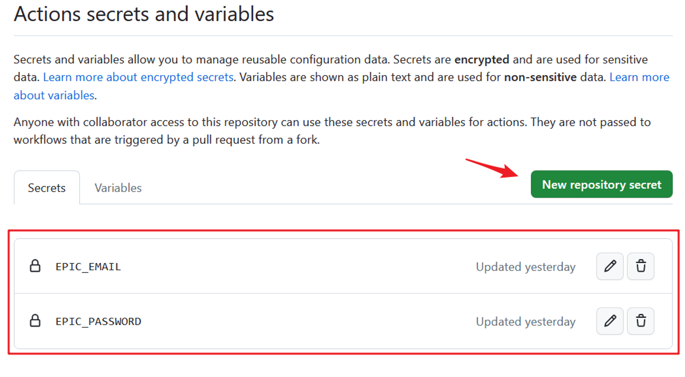
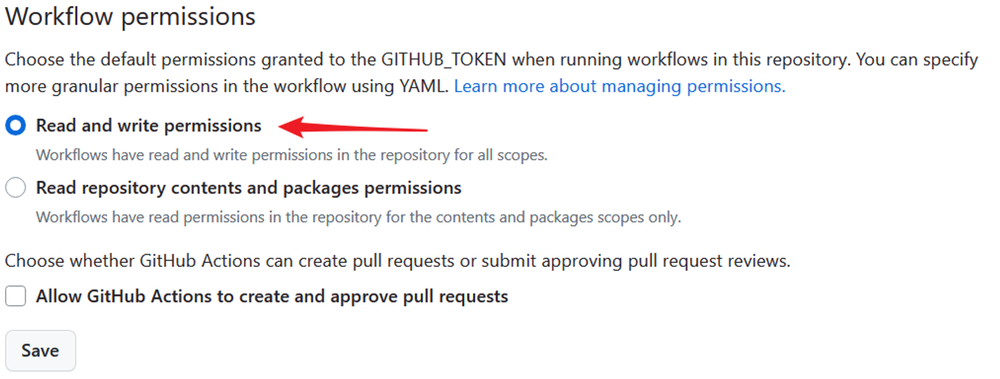
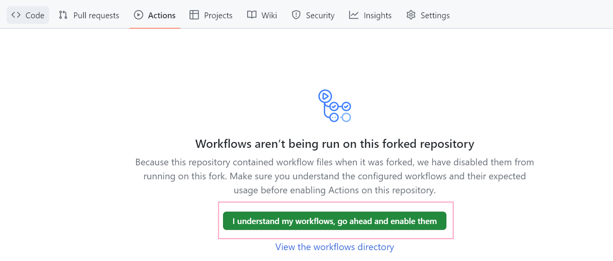
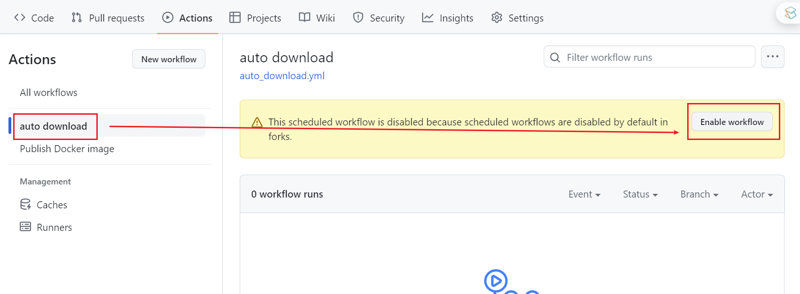
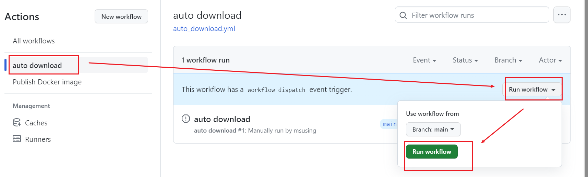

# AutoScore
Automatically get FREE sheets of specific user on mymusicsheet and more.

## Motivation
[HalyconMusic(ハルシオン Anime Piano Covers)](https://www.youtube.com/@HalcyonMusic) is an exceptionally talented piano content creator. Not only does he produce high-quality videos, but he also generously shares his sheet music for free for a limited time after his videos' release. To prevent missing out on the free sheet music due to a busy personal life, I created this repo to get freesheets of but not limited to him. However, whenever I have time, I make sure to support the channel by liking, giving coins(bilibili), favoriting and leaving a comment. So even if using the flow, let's not just be passive viewers.

## Method
Use RSS to get user's free sheets and auto download them. Finally we send files via email or upload to onedrive. The sensitive data is saved in Github repo's secrets thus it's safe. 
Note: If you want to enable uploading to onedrive: see [About Onedrive](#About-Onedrive).

## Usage

### Use Github Action
1. Fork the repo
2. Use your own information to set the needed secrets in your repo(Repo Settings -- Secrets and variables -- Actions -- Secrets). You need an email with SMTP host, port, account and app password. Check out [User config](#User-config) for the full config we need.

3. Enable Workflow r/w permissions
Settings -- Actions -- General

4. Allow the actions to run on your forked repos:
a. Actions-->click "I understand my workflows, go ahead and enable them"

b. Enable the auto download workflow: auto download-->Enable workflow

Then the action will be triggered when pushing to repo or reaching a certain time everyday. The latter can be set in the auto_download.yml.
To test whether your config is correct, you can run a test immediately following the steps below:

If you enable the email sending and set your mail data properly, you should receive an email with run data. You can also check the history running results from the actions tab.

### Use Docker
1. Download the config file:
```
wget https://github.com/Freddd13/auto-Halcyon/blob/main/localconfig.yaml?raw=true -O .localconfig.yaml
```
2. Replace your own data in the yaml above. Check out [User config](#User-config) for the full config we need.
3. Enable Workflow r/w permissions
3. Download image and run:
```
docker pull fredyu13/auto-halcyon
docker run -d --name auto-halcyon -v $(pwd)/.localconfig.yaml:/app/.localconfig.yaml fredyu13/auto-halcyon
```

### User config(This is for Github Action Secrets, but it's similar for yamls when using docker or running locally)
| Variable                  | Description                                         | Example Value          |
|---------------------------|-----------------------------------------------------|------------------------|
| `MMS_email`               | Email associated with MMS website.                | `user@example.com`     |
| `MMS_password`            | Password for the MMS.                        | `passwordiiyokoiyo`          |
| `MMS_savefolder_path`     | Path to the save folder for MMS.                   | `files` (recommended)      |
| `RSS_url`                 | URL of the RSS feed.                               | `https://rsshub.app`|
| `RSS_key`                 | key of your self-hosted rsshub. url->url/SOMEROUTE?key={key} If you don't know what is it, just leave it empty.                               | `123`|
| `enable_email_notify`      | Whether to notify downloading result via email  (1 enable, 0 disable)  | `1` |
| `Email_sender`            | Email address used to send emails.                 | `sender@example.com`   |
| `Email_receivers`         | Email addresses designated to receive emails.      | `receiver@example.com` |
| `Email_smtp_host`         | SMTP server address used to send emails.           | `smtp.example.com`     |
| `Email_smtp_port`         | SMTP server port used to send emails.              | `11451`                  |
| `Email_mail_license`      | SMTP password or authorization used for sending emails.  | `1145141919810`  |
| `Email_send_logs`      | Whether to send email with logs (1 enable, 0 disable)  | `1`  |
| `enable_od_upload`      | Whether to also upload sheets to onedrive (1 enable, 0 disable)  | `0`  |
| `od_client_id`      | onedrive app client id  | `114514`  |
| `od_client_secret`      | onedrive app client secret value | `114514`  |
| `od_redirect_uri`      | onedrive app redirect_ur  | `http://localhost:9001`  |
| `od_upload_dir`      | which onedrive dir to upload sheets to relative to the root, do NOT start with '/'  | `halycon_sheets`  |


## Develop
### Run locally
1. Clone this repo
2. Create a .localconfig.yaml from localconfig.yaml and fill in your data. Check out [User config](#User-config) for the full config we need.
3. `pip install -r requirements.txt`
4. Set env `AUTO_HALCYON_ENV` to `LOCAL`
4. `python main.py`

### Build Docker
1. Clone this repo
2. Create a .localconfig.yaml from localconfig.yaml and fill in your data. 
3. `docker build -t auto-halcyon -f docker/Dockerfile .`
4. `docker run -d --name auto_halcyon auto-halcyon:latest`
The schedule task can be adjusted by modifing the ./docker/crontab.


## Note
### About RSS
Currently the repo depends on [MMS user route rss from RSSHub](https://docs.rsshub.app/routes/social-media#youtube-user). It's recommended to replace the domain with your self-hosted rsshub url, because the public hub can sometimes be banned by source sites. Besides, self-hosting one is quite benefit for your other future usage. If you don't have one, you can use the default url `https://rsshub.app/`.
For more info, please check [RSSHub doc](https://docs.rsshub.app/).


### About Onedrive
To save to onedrive, you need to create an app in [Azure](https://portal.azure.com/#home). Note that currently only onedrive business international is tested.
Check out [here](auto_score/onedrive/README.md) for detailed instructions of getting required data.
The onedrive needs a login for the first time, after that the token will be saved to `_refresh_token`. As I have no idea how to receive auth callback in github action, the code assumes there's already a token file with token. Thus you need to run on local first to generate the token file. 
For github action:
1. Fork this repo,
2. Follow [Run locally](#Run-locally) (clone your own repo) to run once.
3. Check if the token file generates successfully, and push the code with token file to your repo.
```bash
git add _refresh_token && git commit -m "add token" && git push
```
4. Follow [Use Github Action](#Use-Github-Action)


### About Email
The `enable_email_notify` is used to send you downloading result including sheets and app log. If you disable the email, there's still another way to save your sheets: remove the `MMS_savefolder_path` directory if it exists in the `.gitignore`. The action will update the downloaded sheets to your repo. But it's not a good behavior to share others' sheets without permission, thus it's not recommended to disable email before other uploading method is supported.


## TODO
- [x] Email notification
- [x] Ignore History downloaded sheets
- [x] Docker support
- [x] Save to Onedrive/Cloudreve
- [ ] Gumroad support


# Disclaimer:
The scripts provided in this repo is intended for personal use and convenience. It is the user's responsibility to use this tool in accordance with the terms of service and policies of MMS.

The author of this repo shall not be held responsible for any misuse or improper use of this tool, including but not limited to any violations of MMS's terms of service, copyright infringement, or any other legal or ethical concerns.

Users are advised to exercise discretion and adhere to all applicable laws and regulations when using this tool. The author of this tool disclaim all liability for any consequences resulting from the use of this tool.

By using this tool, you agree to accept all responsibility and legal consequences that may arise from its use.
Please use this tool responsibly and in compliance with MMS's terms and conditions.
